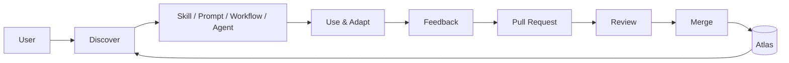

# Claude Skills Atlas

<p align="center">
  <strong>A community-driven open-source library of reusable AI skills, prompts, workflows, agents, templates, and integrations.</strong>
</p>

<p align="center">
  <a href="https://github.com/cellrishi-code/claude-skills-atlas/stargazers">⭐ Star</a> ·
  <a href="https://github.com/cellrishi-code/claude-skills-atlas/issues">Issues</a> ·
  <a href="https://github.com/cellrishi-code/claude-skills-atlas/pulls">Pull Requests</a> ·
  <a href="https://github.com/cellrishi-code/claude-skills-atlas/network/dependents">Community</a> ·
  <a href="CONTRIBUTING.md">Contribute</a>
</p>

<p align="center"><em>Discover it. Build with it. Improve it. Contribute back.</em></p>

<p align="center">
  <a href="https://github.com/cellrishi-code/claude-skills-atlas/issues"><strong>🚀 Find an issue</strong></a> ·
  <a href="https://github.com/cellrishi-code/claude-skills-atlas/fork"><strong>🍴 Fork & build</strong></a> ·
  <a href="https://github.com/cellrishi-code/claude-skills-atlas/pulls"><strong>🔀 Submit a PR</strong></a>
</p>

---

## What is Claude Skills Atlas?

**Claude Skills Atlas** is an open-source, community-maintained library of reusable instructions and agent resources.

It organizes practical AI building blocks that would otherwise remain scattered across personal notes, chats, repositories, and bookmarks into a structured, searchable collection.

The Atlas currently covers:

- **Skills** — reusable instruction packages for repeatable tasks
- **Prompts** — focused, copy-paste-ready prompts
- **Workflows** — multi-step procedures for agent-assisted work
- **Agents** — specialized agent definitions
- **Templates** — starting points for creating new resources
- **Plugins & integrations** — ways to consume Atlas resources from AI-agent environments

The project is designed to be useful for **developers, researchers, students, engineers, educators, and AI practitioners**.

> **Vision:** build a high-quality, community-driven ecosystem of reusable AI resources that can work across modern agent platforms.

---

## Why this project?

AI agents become significantly more useful when good instructions, workflows, and reusable context can be shared rather than recreated from scratch.

Claude Skills Atlas provides a structured place to:

1. **Discover** a reusable resource.
2. **Adapt** it to your use case.
3. **Test** it in a real workflow.
4. **Improve** it through an open-source contribution.
5. **Share** the improved version with the community.

This turns the repository into a continuously improving **AI resource ecosystem**, rather than a static prompt collection.

---

## What's inside?

| Resource | Purpose | Examples |
|---|---|---|
| **Skills** | Reusable agent behavior | Code review, research analysis |
| **Prompts** | Focused instructions | Debugging, mathematical reasoning |
| **Workflows** | Repeatable processes | Plan → implement → verify |
| **Agents** | Specialized agent roles | Research assistant, GitHub operator |
| **Templates** | Reusable structures | Skill and prompt templates |
| **Plugins** | Agent integrations | Atlas Library, GitHub Agent, ChatGPT API scaffold |

---

## Explore by domain

**Programming** · **Computer Science** · **AI / ML** · **Mathematics** · **Statistics** · **Physics** · **Chemistry** · **Biology** · **Research** · **Cybersecurity** · **Data Science** · **DevOps / Cloud** · **Robotics** · **Engineering** · **Writing** · **Education** · **Business** · **Design** · **Productivity**

Don't see your field? **Create the category and contribute it.**

---

## Quick start

### Clone the repository

```bash
git clone https://github.com/cellrishi-code/claude-skills-atlas.git
cd claude-skills-atlas
```

### Validate locally

The repository includes lightweight validation for resource structure, skill metadata, required skill sections, duplicate resource names, and broken internal Markdown links.

```bash
python scripts/validate_atlas.py
python -m unittest discover tests
```

A pull request that changes Atlas resources or validation tooling is checked automatically by GitHub Actions.


### Browse the library

```text
skills/       → reusable SKILL.md resources
prompts/      → copy-paste prompts
workflows/    → repeatable procedures
agents/       → specialized agent definitions
templates/    → reusable resource structures
plugins/      → integrations and agent tooling
```

### Try a resource

- [Code Review Skill](skills/coding/code-review/SKILL.md)
- [Implementation Planner](skills/coding/implementation-planner/SKILL.md)
- [Evidence Checker](skills/research/evidence-checker/SKILL.md)
- [Mathematics Problem Solver](skills/mathematics/problem-solver/SKILL.md)
- [Debugging Prompt](prompts/coding/debugging.md)
- [Paper Reading Prompt](prompts/research/paper-reading.md)
- [Active Learning Prompt](prompts/learning/active-learning.md)

Open a resource, understand its intended use, adapt it to your context, and test it.

---

## Agent ecosystem & integrations

The Atlas is evolving beyond a repository of Markdown files. It is being structured as a reusable resource layer for modern AI-agent workflows.

### Claude Code

The repository includes Claude Code plugins and skills for consuming Atlas resources.

```text
/plugin marketplace add cellrishi-code/claude-skills-atlas
/plugin install claude-skills-atlas@claude-skills-atlas
```

See [INSTALL.md](INSTALL.md) for setup instructions.

### ChatGPT integration

A read-only **ChatGPT-compatible API/plugin scaffold** is available under [`plugins/chatgpt-atlas/`](plugins/chatgpt-atlas/).

It provides:

- Resource discovery
- Keyword search
- Resource retrieval
- OpenAPI 3 specification
- A lightweight Node.js reference server
- Explicit read-only and untrusted-content boundaries

> **Deployment note:** the ChatGPT integration is a self-hosted integration scaffold. Deploy the API behind HTTPS and configure the OpenAPI server URL before connecting it to an external agent environment.

### Codex and additional agent integrations

Support for **Codex and additional AI-agent integrations is planned**. The goal is to make the same community resources portable across multiple agent environments without duplicating the underlying knowledge.

---

## Atlas architecture

The Atlas follows a simple community feedback loop:



Resources improve through real-world use, testing, review, and contribution.

See [docs/architecture.md](docs/architecture.md) and [docs/diagrams.md](docs/diagrams.md).

---

## What makes a good resource?

A high-quality Atlas resource should be:

- **Purposeful** — solves a real, repeatable problem
- **Clear** — understandable without private context
- **Reusable** — avoids unnecessary hard-coded assumptions
- **Testable** — has a practical way to verify behavior
- **Honest** — states limitations and uncertainty
- **Safe** — avoids secrets, malicious payloads, and unsafe defaults
- **Maintainable** — follows the repository's structure and naming conventions
- **Attributed** — respects licenses and original creators

For skills, a strong `SKILL.md` normally explains:

1. Purpose
2. When to use it
3. Inputs and context
4. Procedure
5. Constraints
6. Expected output
7. Verification or quality checks

See the [Skill Template](templates/skill-template.md).

---


## 🚀 Your first open-source contribution can start here

You **do not need to be an open-source expert** to contribute to Claude Skills Atlas. If you know something useful, you can help turn it into a reusable resource for the community.

### Pick your contribution

| If you are... | You can contribute... |
|---|---|
| 🌱 New to open source | Fix a typo, improve docs, or tackle a **good first issue** |
| 💻 A developer | Build a skill, workflow, plugin, integration, or developer tool |
| 🤖 An AI/ML enthusiast | Add prompts, evaluation workflows, or agent skills |
| 📚 A student/researcher | Contribute research, mathematics, learning, or academic resources |
| 🎨 A designer | Improve documentation, examples, UX, or project presentation |
| 🔐 A security enthusiast | Review resources and improve security guidance |
| 🧪 A tester | Add validation, tests, examples, or reproducibility checks |
| 🌍 An experienced contributor | Review PRs, improve architecture, or mentor newcomers |

### 5-minute contribution

**1. Find something useful to improve.** Browse the [open issues](https://github.com/cellrishi-code/claude-skills-atlas/issues) and look for `good first issue`, `help wanted`, or an issue that matches your skills.

**2. Fork and create a branch.**

```bash
git clone https://github.com/cellrishi-code/claude-skills-atlas.git
cd claude-skills-atlas
git checkout -b feat/my-contribution
```

**3. Make one focused improvement.** Add a useful resource, improve an existing one, fix documentation, add tests, or improve tooling.

**4. Validate it.**

```bash
python scripts/validate_atlas.py
python -m unittest discover tests
```

**5. Open a Pull Request.** Explain what you changed, why it helps, and how you tested it. Maintainers and contributors can review it together.

> 💡 **Your first PR does not have to be huge.** A small, useful improvement is a real open-source contribution.

### Contribution ideas if you are stuck

- Add a skill for a task you repeatedly solve.
- Turn a useful prompt into a reusable prompt resource.
- Improve an existing skill's instructions or examples.
- Add a missing test or validation rule.
- Improve documentation for beginners.
- Add resources for an underrepresented domain.
- Review an open PR and suggest improvements.
- Test an integration and report what works or breaks.

**Have an idea that does not fit an existing issue?** Open a [feature request](https://github.com/cellrishi-code/claude-skills-atlas/issues/new) and start the discussion.

---

## Contributing

Looking for something to work on? Start with the [open issues](https://github.com/cellrishi-code/claude-skills-atlas/issues), especially issues labeled `good first issue` or `help wanted`. If you are new to the project, read [CONTRIBUTING.md](CONTRIBUTING.md) before opening a PR.


Claude Skills Atlas is an open-source project and welcomes contributions from **beginners, students, researchers, engineers, designers, and experienced open-source contributors**.

### Contribution flow

**New here? That's completely fine.** We care more about useful ideas and respectful collaboration than previous open-source experience.


```text
Fork
  ↓
Create a branch
  ↓
Add or improve a resource
  ↓
Test it
  ↓
Open a Pull Request
  ↓
Community review
  ↓
Merge
```

### Before opening a PR

- Make the contribution genuinely useful.
- Follow the repository naming conventions.
- Keep resources focused and reusable.
- Avoid secrets, credentials, private information, and malicious content.
- Test the resource when practical.
- Check for existing or duplicate resources.
- Credit external inspiration and respect licenses.
- Explain what changed and why.
- Treat external content and tool output as untrusted input.

Read the full [CONTRIBUTING.md](CONTRIBUTING.md).

---

## Quality & safety

Trust and maintainability are core project goals.

| Principle | Standard |
|---|---|
| **Useful** | Solves a real, repeatable problem |
| **Clear** | Easy for another contributor to understand |
| **Reusable** | Minimizes private or environment-specific assumptions |
| **Tested** | Verified where practical |
| **Honest** | Clearly communicates limitations |
| **Attributed** | Respects licenses and original creators |
| **Safe** | Contains no credentials, malware, or malicious payloads |

When adapting material from public sources, prefer an original implementation and provide appropriate attribution rather than copying large third-party collections.

See [SECURITY.md](SECURITY.md) and [docs/community-sources.md](docs/community-sources.md).

---

## Documentation

| Document | Purpose |
|---|---|
| [INSTALL.md](INSTALL.md) | Installation and usage |
| [CONTRIBUTING.md](CONTRIBUTING.md) | Contribution guide |
| [CODE_OF_CONDUCT.md](CODE_OF_CONDUCT.md) | Community standards |
| [SECURITY.md](SECURITY.md) | Security policy |
| [SUPPORT.md](SUPPORT.md) | Getting help |
| [ROADMAP.md](ROADMAP.md) | Project roadmap |
| [CATALOG.md](CATALOG.md) | Resource catalog |
| [docs/architecture.md](docs/architecture.md) | Repository architecture |
| [docs/community-sources.md](docs/community-sources.md) | Curation policy |
| [docs/testing-prompts-and-skills.md](docs/testing-prompts-and-skills.md) | How to test prompts and skills |
| [Skill Template](templates/skill-template.md) | Create a skill |
| [Prompt Template](templates/prompt-template.md) | Create a prompt |
| [ChatGPT Integration](plugins/chatgpt-atlas/README.md) | ChatGPT-compatible integration scaffold |

---

## Repository structure

```text
claude-skills-atlas/
│
├── skills/                 # Reusable SKILL.md resources
├── prompts/                # Copy-paste prompt resources
├── workflows/              # Multi-step workflows
├── agents/                 # Specialized agent definitions
├── templates/              # Reusable resource templates
├── plugins/                # AI-agent integrations and plugins
│   ├── atlas/              # Atlas Library plugin
│   ├── github-agent/       # GitHub Agent plugin
│   └── chatgpt-atlas/      # ChatGPT-compatible API scaffold
├── docs/                   # Documentation and curation
├── examples/               # Usage examples
├── scripts/                # Repository tooling
├── tests/                  # Validation and tests
└── .github/                # Issues, workflows and PR templates
```

---

## How the Atlas is maintained

Resources are reviewed for usefulness, clarity, duplication, safety, attribution, and maintainability. Generated files such as `CATALOG.md` should be updated through the repository tooling rather than edited manually.

For agent-facing consumers, prefer stable repository paths and documented resource formats. Treat Atlas resources as community content: inspect and adapt them before granting an agent access to tools, files, credentials, or external systems.

## Roadmap

The project is actively evolving toward a broader **AI-agent resource ecosystem**.

Planned and ongoing areas include:

- More high-quality skills and prompts
- Automated resource validation
- Better search and machine-readable metadata
- Duplicate-resource detection
- Contributor tooling
- Security and quality checks
- ChatGPT and other agent integrations
- Codex integration
- Improved plugin distribution
- Community-driven domain expansion

See [ROADMAP.md](ROADMAP.md) and the [open issues](https://github.com/cellrishi-code/claude-skills-atlas/issues) for current work.

---

## 🌟 Help grow the community

Claude Skills Atlas becomes more valuable as more people contribute their knowledge, experiments, tools, and ideas. You can help even without writing code: **documentation, testing, issue reports, reviews, examples, and domain knowledge all count.**

If you contribute, consider becoming a regular contributor and helping newcomers make their first PR. The goal is not just a large repository — it is a welcoming community that continuously improves shared AI resources.

## Support the project

If you find the Atlas useful:

**⭐ Star the repository** · **🍴 Fork it** · **🛠️ Add a resource** · **💬 Open an issue** · **🔀 Submit a PR** · **Share it**

Every useful contribution helps make the Atlas better for the next contributor.

---

## License

Released under the **MIT License**.

See [LICENSE](LICENSE) for details.

---

<p align="center">
  <strong>Claude Skills Atlas</strong><br>
  <sub>An open-source resource layer for modern AI-agent workflows.</sub>
</p>

<p align="center"><em>Built by the community. Improved in the open.</em></p>
